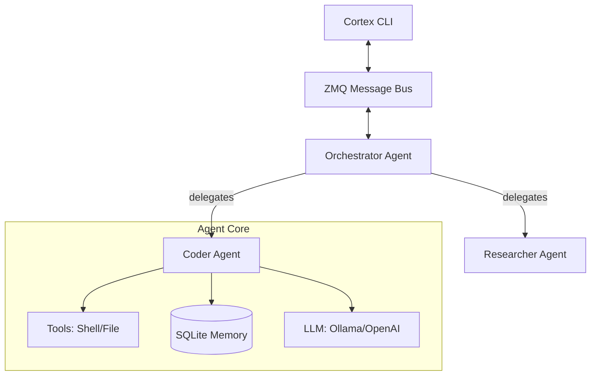

# 🧠 Cortex: The Multi-Agent Operating System

[](https://opensource.org/licenses/MIT)
[](https://en.wikipedia.org/wiki/C%2B%2B20)
[](#)

Cortex is a **high-performance, local-first multi-agent orchestration framework** built in C++20. It's not just a wrapper; it's an environment where agents live, think, and collaborate via a low-latency messaging bus.

---

## ⚡ Quick Start (One-Line Install)

Get up and running on Linux in seconds:

```bash
curl -sSL https://raw.githubusercontent.com/Sriyush/CortexCLI/main/scripts/install.sh | bash
```

---

## 🚀 Key Features

### 🎙️ Advanced Orchestration
- **Orchestration Agent**: A "Manager" agent that breaks down tasks and delegates them to specialized workers.
- **Dynamic Delegation**: Agents can assign sub-tasks to each other, forming a hierarchy of intelligence.
- **Robust Tool Detection**: Intelligent parsing of agent responses, handling strict JSON fences or raw output.

### 🛠️ Native Tool Execution
- **File I/O**: `read_file` and `write_file` (with automatic parent directory creation).
- **Shell Power**: `run_shell` allows agents to execute bash commands directly.
- **Structured JSON**: All tool calls follow a strict schema for reliability.

### 🕵️ Centralized Intelligence Logging
- **Thread-Safe Logging**: Real-time activity tracking to `logs.txt` from all agents.
- **System Redirection**: Captures ALL console output (`stdout`/`stderr`) into the log file for full auditability.
- **`cortex logs`**: Dedicated command to view/monitor agent activities and tool results.

### 🤖 Specialized Agent Roles
- `coder`: Expertise in C++, Python, and software architecture.
- `researcher`: Optimized for data gathering and technical analysis.
- `critic`: Provides ruthless review and edge-case identification.
- `orchestrator`: The brain that manages workers and summarizes results.

---

## 🔭 Architecture

Cortex uses a **Hub-and-Spoke** messaging architecture powered by **ZeroMQ**.



---

## 📖 Usage Guide

### 1. Unified Run Command
Execute complex tasks with any specialized agent.
```bash
# Optional: save response to file with -o
./build/cortex run "What is the capital of France?" -a qween

# Advanced: create a project structure
./build/cortex run "Create an 'experiments' folder with a 'hello.py' inside" -a qween
```

### 2. Log Monitoring
Keep track of what your agents are doing behind the scenes.
```bash
# View last 50 lines of activity
./build/cortex logs

# View logs for a specific agent
./build/cortex logs qween

# Clear all history
./build/cortex logs --clear
```

### 3. Agent Lifecycle
```bash
# Create a custom agent
./build/cortex agent create my-coder coder --ollama -m phi3

# List your team
./build/cortex agent list

# Manage processes
./build/cortex agent start my-coder
./build/cortex agent stop my-coder
```

### 4. Auth & Configuration
```bash
# Setup API keys for Remote Providers (Gemini, OpenAI, Claude)
./build/cortex auth

# Check local model availability
./build/cortex model list
```

---

## 🛠 Build from Source

### Prerequisites
- CMake (>= 3.20)
- GCC (>= 11)
- ZeroMQ, SQLite3, OpenSSL

### Build
```bash
mkdir -p build && cd build
cmake ..
make -j$(nproc)
```

---

## 📡 Roadmap

- [x] **Phase 1-3**: ZMQ Bus, Persistent Memory, Structured JSON.
- [x] **Phase 4**: Advanced Logging & Tool Execution (Shell, File I/O).
- [x] **Phase 5**: Task Orchestration (Multi-agent delegation).
- [ ] **Phase 6**: Agent Memory (Retrievable Embeddings).
- [ ] **Phase 7**: PID-based Process Management.
- [ ] **Phase 8**: Python/Plugin SDK.

---

## 📄 License
MIT © 2026 Cortex CLI Team
