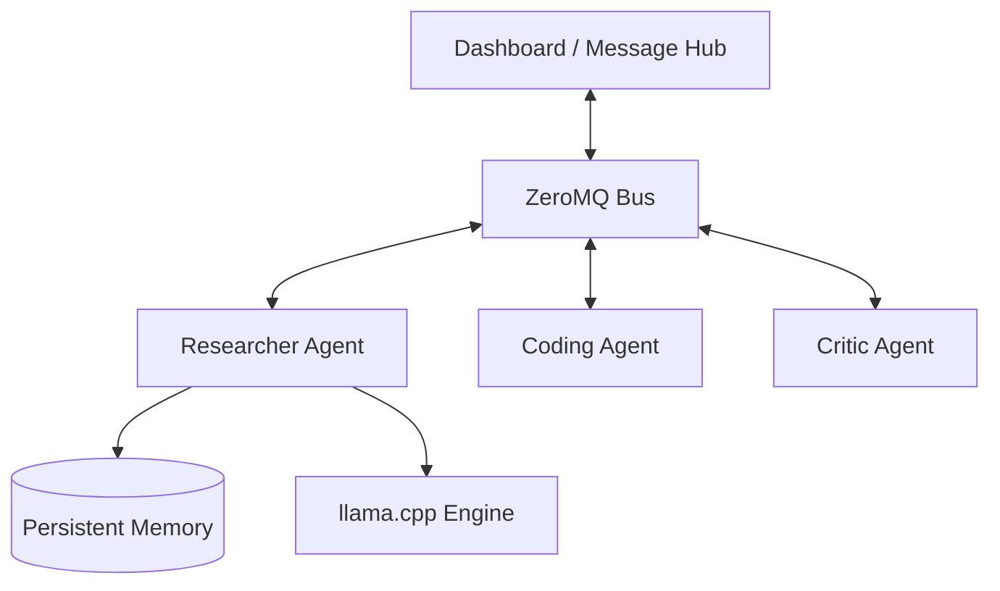

# Cortex CLI: Multi-Agent Operating Environment

Cortex CLI is a high-performance, local-first multi-agent orchestration framework built in C++20. It provides a robust messaging infrastructure, persistent memory, and integrated local LLM inference via `llama.cpp`, all monitored through a sleek terminal-based dashboard.

## 🚀 Features

- **Local LLM Inference**: Direct integration with `llama.cpp` for GGUF model support.
- **Asynchronous Messaging**: ZeroMQ-powered bus architecture for low-latency agent communication.
- **Persistent Memory**: SQLite-backed long-term storage for agent states and message history.
- **Specialized Agent Roles**: 
  - `Researcher`: Focused on technical data and evidence.
  - `Coder`: High-efficiency architectural and implementation focus.
  - `Critic`: Ruthless reviewer for identifying edge cases and security risks.
- **Rich TUI Dashboard**: Real-time monitoring of agent health and protocol logs using FTXUI.
- **Extensible Tool System**: Native support for File I/O and Shell execution.

## 🏗 Architecture

Cortex uses a Hub-and-Spoke messaging architecture where the Dashboard acts as the central message broker (Hub) and individual agents act as clients (Spokes).



## 🛠 Installation & Build

### Prerequisites
- CMake (>= 3.20)
- GCC (>= 11) or Clang (>= 13)
- ZeroMQ (libzmq and cppzmq)
- SQLite3

### Build Instructions
```bash
# Clone the repository
git clone https://github.com/user/CortexCLI.git
cd CortexCLI

# Run the build script
./scripts/build.sh
```

## 📖 Usage Guide

### 1. Start the Dashboard (The Hub)
The dashboard must be running to route messages between agents. To enable real AI generation, provide a path to a GGUF model.

```bash
# With AI engine enabled
./build/cortex --dashboard --model ./models/llama-3-8b.gguf

# Fallback mode (Simulation)
./build/cortex --dashboard
```

### 2. Manage Agents
In a separate terminal, you can create and manage agents:

```bash
# Create specialized agents
./build/cortex agent create researcher_alice researcher
./build/cortex agent create coder_bob coder

# List current agents
./build/cortex agent list
```

### 3. Orchestrate a Debate
Initiate a discussion between your agents on a specific topic:

```bash
./build/cortex debate --topic "Rust vs C++ for System Programming" -p researcher_alice coder_bob
```

## 📂 Project Structure

- `agents/`: Specialized agent implementations.
- `cli/`: CLI command parsing and subcommands.
- `core/`: Core orchestrators (AgentManager, DebateManager).
- `llm/`: Llama.cpp integration and inference logic.
- `messaging/`: ZeroMQ bus and protocol definitions.
- `memory/`: SQLite persistence layer.
- `tui/`: FTXUI dashboard and rendering logic.
- `tools/`: Agent tool system (FileSystem, Shell).

## 🗺 Roadmap

- [x] Phase 1: Foundation & Build System
- [x] Phase 2: ZeroMQ Communication Layer
- [x] Phase 3: AI Engine Integration (Inference)
- [x] Phase 4: Specialized Agent Personas
- [ ] Phase 5: Multi-step Task Decomposition
- [ ] Phase 6: Plugin architecture for external tools

## 📄 License
This project is licensed under the MIT License.
