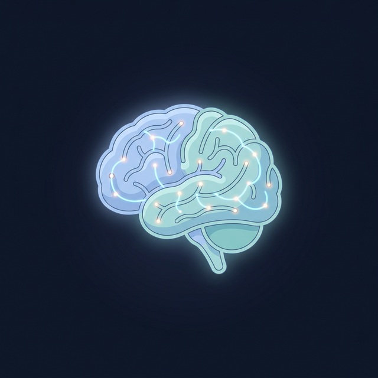
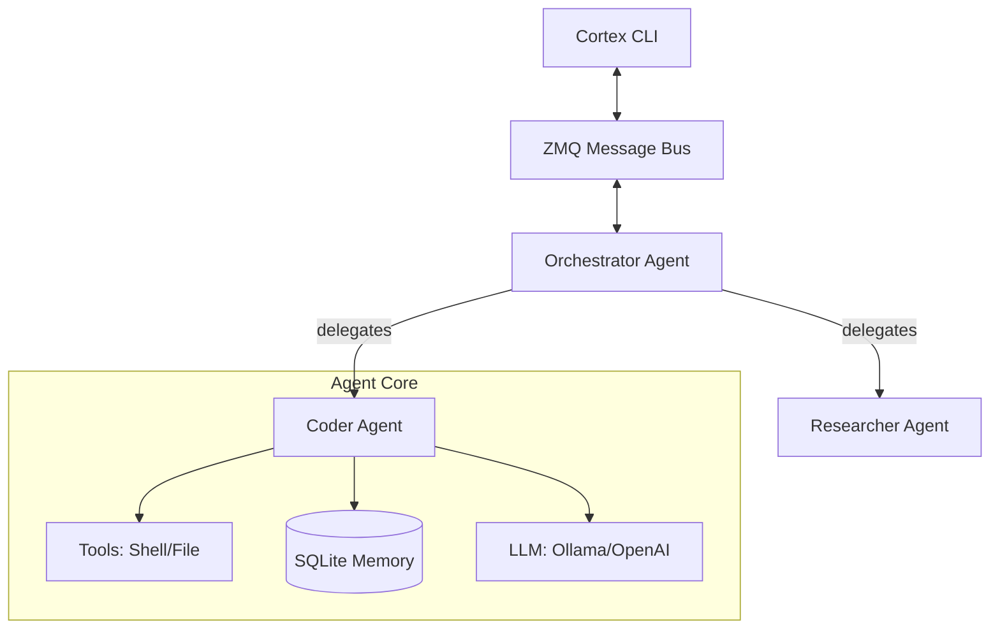

# 🧠 Cortex: The Multi-Agent Operating System

[](https://opensource.org/licenses/MIT)
[](https://en.wikipedia.org/wiki/C%2B%2B20)
[](#)

Cortex is a **high-performance, local-first multi-agent orchestration framework** built in C++20. It's not just a wrapper; it's an environment where agents live, think, and collaborate via a low-latency messaging bus.

---

## ⚡ Quick Start (One-Line Install)

Get up and running on Linux in seconds:

```bash
curl -sSL https://raw.githubusercontent.com/Sriyush/CortexCLI/main/scripts/install.sh | bash
```

---

## 🚀 Key Features

### 🎙️ Advanced Orchestration
- **Orchestration Agent**: A "Manager" agent that breaks down tasks and delegates them to specialized workers.
- **Dynamic Delegation**: Agents can assign sub-tasks to each other, forming a hierarchy of intelligence.
- **Robust Tool Detection**: Intelligent parsing of agent responses, handling strict JSON fences or raw output.

### 🛠️ Native Tool Execution
- **File I/O**: `read_file` and `write_file` (with automatic parent directory creation).
- **Shell Power**: `run_shell` allows agents to execute bash commands directly.
- **Structured JSON**: All tool calls follow a strict schema for reliability.

### 🕵️ Centralized Intelligence Logging
- **Thread-Safe Logging**: Real-time activity tracking to `logs.txt` from all agents.
- **System Redirection**: Captures ALL console output (`stdout`/`stderr`) into the log file for full auditability.
- **`cortex logs`**: Dedicated command to view/monitor agent activities and tool results.

---

## 📖 Command Reference

Cortex provides a rich CLI for managing agents, models, and workflows.

### 1. Global Flags
| Flag | Description |
|------|-------------|
| `-d, --dashboard` | Launches the real-time TUI dashboard. |
| `-m, --model <name>` | Selects the LLM model for the specific command. |
| `--provider <name>` | Sets the provider (ollama, openai, gemini, claude). |
| `--ollama-url <url>`| Sets the Ollama API endpoint (default: http://localhost:11434). |

### 2. Task Execution
```bash
# Run a single task with an agent
cortex run "Create a new folder 'scaffold' and add a main.cpp" -a qween

# Optional: Save the agent's response to an output file
cortex run "Explain quantum computing" -o quantum.md
```

### 3. Agent Management (`cortex agent`)
| Command | Description |
|---------|-------------|
| `create <name> <type>` | Creates a new agent (Types: researcher, coder, critic, generic). |
| `list` | Lists all agents and their types. |
| `start <name>` | Boots up an agent process. |
| `stop <name>` | Safely shuts down an agent. |
| `delete <name>` | Removes an agent from the environment. |

### 4. Intel & Monitoring
```bash
# View last 50 lines of system logs
cortex logs

# Filter logs for a specific agent
cortex logs qween

# Clearing the audit trail
cortex logs --clear
```

### 5. Multi-Agent Workflows
Coordinate multiple agents on complex topics or goals.
```bash
# Start a live debate between agents
cortex debate start --topic "C++ vs Rust" -p Alice -p Bob

# End all active debates
cortex debate stop

# Team-based goal execution
cortex work -g "Design a high-performance ZMQ bus" -a Alice,Bob
```

---

## 🏗 Architecture

Cortex uses a **Hub-and-Spoke** messaging architecture powered by **ZeroMQ**.



---

## 🛠 Build from Source

### Prerequisites
- CMake (>= 3.20)
- GCC (>= 11)
- ZeroMQ, SQLite3, OpenSSL

### Build
```bash
mkdir -p build && cd build
cmake ..
make -j$(nproc)
```

---

## � Roadmap

- [x] **Phase 1**: ZeroMQ Bus & Ollama Core Integration
- [x] **Phase 2**: Persistent Memory & Per-Agent LLM Config
- [x] **Phase 3**: Structured JSON Message Schemas
- [x] **Phase 4**: Advanced Logging & Shell/File Tool Execution
- [x] **Phase 5**: Multi-Agent Task Orchestration & Delegation
- [ ] **Phase 6**: Agent Memory (SQLite + Vector Embeddings)
- [ ] **Phase 7**: PID-based Process Management & Cluster Control
- [ ] **Phase 8**: Extension SDK (Python) & Plugin Ecosystem

---

## �📄 License
MIT © 2026 Cortex CLI Team
