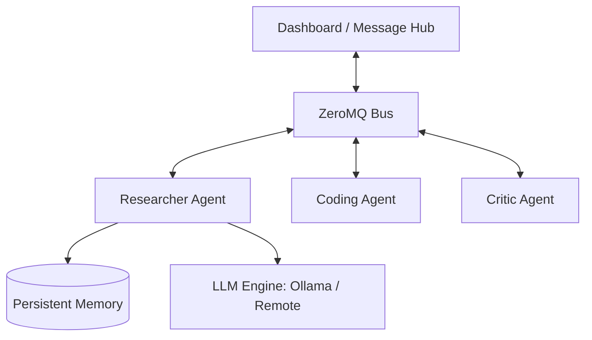

# Cortex CLI: Multi-Agent Operating Environment

Cortex CLI is a high-performance, local-first multi-agent orchestration framework built in C++20. It provides a robust messaging infrastructure, persistent memory, and integrated local LLM inference via **Ollama** and **llama.cpp**, all monitored through a sleek terminal-based dashboard.

## 🚀 Features

- **Local LLM Inference**: Seamless integration with **Ollama** for high-performance local inference. Now with **automatic model discovery**.
- **Remote LLM Inference**: Native support for **Gemini**, **OpenAI**, and **Claude** via secure API keys.
- **Asynchronous Messaging**: ZeroMQ-powered bus architecture for low-latency agent communication.
- **Persistent Memory**: SQLite-backed long-term storage for agent states and message history. Supports **per-agent LLM configurations**.
- **Specialized Agent Roles**: 
  - `Planner`: Breaks tasks into actionable steps.
  - `Researcher`: Finds technical data and evidence.
  - `Coder`: High-efficiency architectural and implementation focus.
  - `Critic`: Ruthless reviewer for identifying edge cases and security risks.
- **Rich TUI Dashboard**: Real-time monitoring of agent health, protocol logs, and system stats using FTXUI.
- **Agent OS Design**: PID-based process management (`cortex ps`, `cortex kill`) and dynamic state tracking.

## 🏗 Architecture

Cortex uses a Hub-and-Spoke messaging architecture where the Dashboard acts as the central message broker (Hub) and individual agents act as clients (Spokes).



## 🛠 Installation & Build

### Prerequisites
- CMake (>= 3.20)
- GCC (>= 11) or Clang (>= 13)
- ZeroMQ (libzmq and cppzmq)
- SQLite3
- [Ollama](https://ollama.com/) (Recommended for easiest setup)

### Build Instructions
```bash
# Clone the repository
git clone https://github.com/user/CortexCLI.git
cd CortexCLI

# Optimized build (Ollama only, faster setup)
mkdir -p build && cd build
cmake .. -DUSE_LLAMA_CPP=OFF
make -j$(nproc)
```

## 📖 Usage Guide

### 1. Configure Providers
Use the `auth` command to set your default provider and API keys.
```bash
./build/cortex auth
```

### 2. Manage Agents
Create, list, and delete agents. Agents now support **persistent LLM settings**.

```bash
# Create an agent using default Ollama model (auto-picks first available)
./build/cortex agent create alice researcher --ollama

# Create an agent with a specific model
./build/cortex agent create bob coder --ollama -m llama3:8b

# List and manage agents
./build/cortex agent list
./build/cortex pdel -p alice bob
```

### 3. Ollama Model Control
Manage your local Ollama models directly from the CLI.
```bash
# List local models
./build/cortex model list

# Remove a model
./build/cortex model rm tinyllama:latest
```

### 4. Tasks & Debates
Initiate or stop discussions and tasks.
```bash
# Start the dashboard (Terminal 1)
./build/cortex -d

# Start a multi-agent debate (Terminal 2)
./build/cortex debate start --topic "Is AI better than humans at coding?" -p Alice -p Bob

# Run a specific development task
./build/cortex run "Build a websocket server in C++"

# Stop all active debates/tasks
./build/cortex debate stop
```

---

## 🔮 Future Vision: The Agentic OS

Cortex is evolving into a full-scale Operating System for AI Agents.

1. **Structured Messaging**: Transitioning to high-fidelity JSON schemas for agent arguments, research, and coordination.
2. **Tool Execution System**: Native capability for agents to `run_shell`, `read_file`, `search_repo`, and `run_tests`.
3. **Advanced Memory**: SQLite-backed embedding storage (`agent_memory`) to allow agents to learn over time.
4. **PID-based Management**: Control agents like Linux processes (`cortex ps`, `cortex kill [PID]`).
5. **System Telemetry**: Real-time token usage, memory pressure, and agent state monitoring in the dashboard.

---

## 🗺 Roadmap

- [x] Phase 1: ZeroMQ Bus & Ollama Integration
- [x] Phase 2: Per-Agent LLM Configuration
- [ ] Phase 3: **Agent Message Schema (Structured JSON)**
- [ ] Phase 4: **Tool Execution System (Shell, File I/O)**
- [ ] Phase 5: **Task Orchestration (Team-based workflows)**
- [ ] Phase 6: **Agent Memory (SQLite + Embeddings)**
- [ ] Phase 7: **PID Process Management & Kill Commands**
- [ ] Phase 8: **Plugin System & External Integration**

## 📄 License
This project is licensed under the MIT License.
